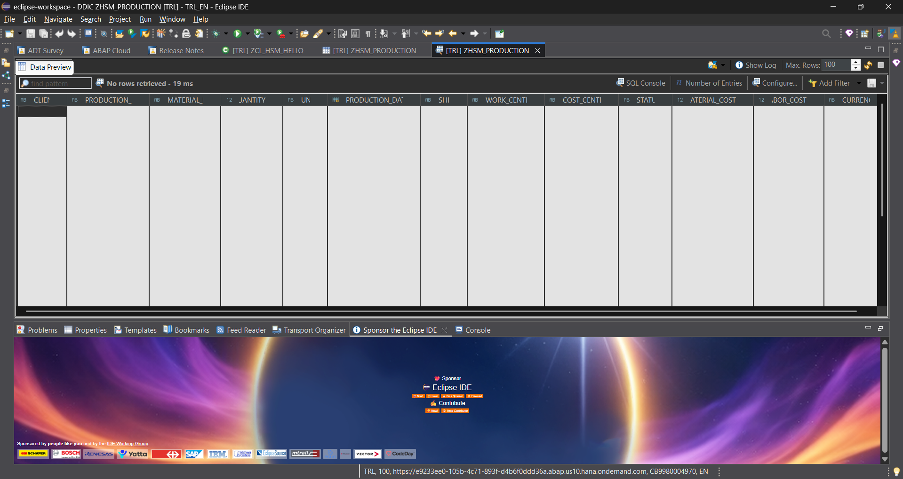
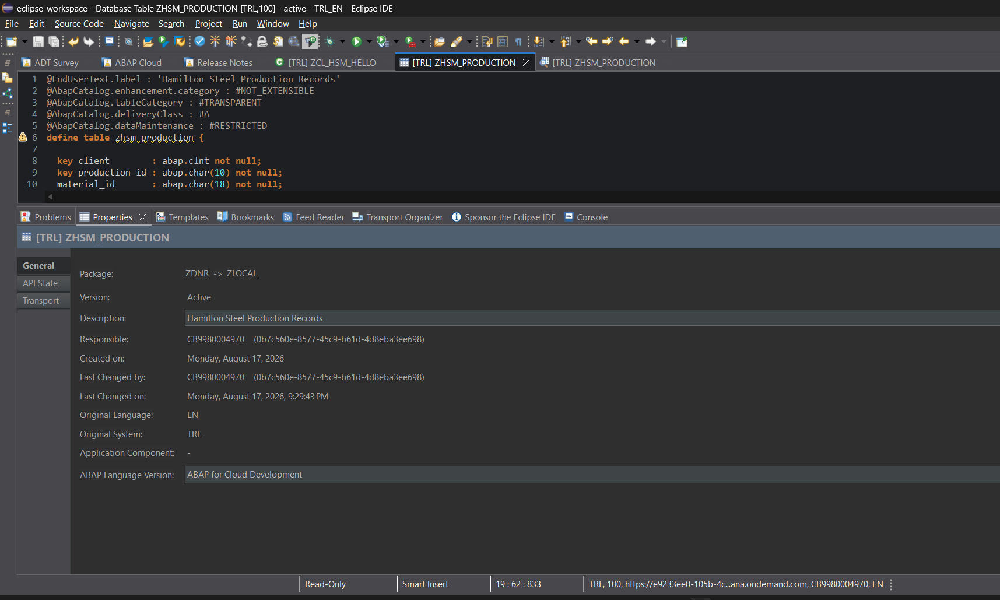
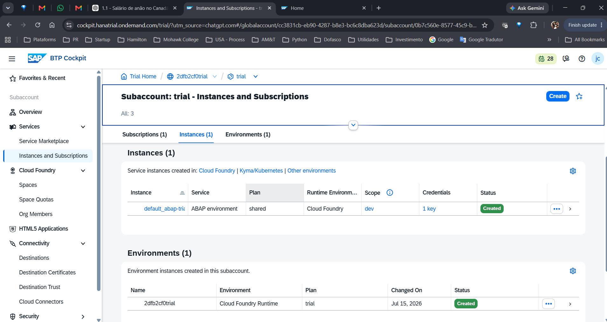

# Sprint 02 — Production and Cost Data Model

## Status

**Completed**

## Objective

Design and implement the first persistent business data model for Hamilton Steel Manufacturing using the SAP ABAP Dictionary and ABAP Cloud.

## Business Scenario

Hamilton Steel Manufacturing needs a centralized production record containing operational and financial information.

## SAP Object

| Property | Value |
|---|---|
| Object Type | Database Table |
| Object Name | `ZHSM_PRODUCTION` |
| Description | Hamilton Steel Production Records |
| Package | `ZDNR` |
| SAP System | `TRL` |
| Language Version | ABAP for Cloud Development |
| Development Tool | Eclipse ADT |
| Status | Active |

## Data Model

| Field | Purpose |
|---|---|
| `CLIENT` | SAP client |
| `PRODUCTION_ID` | Unique production record identifier |
| `MATERIAL_ID` | Material being produced |
| `QUANTITY` | Production quantity |
| `UNIT` | Unit of measure |
| `PRODUCTION_DATE` | Date of production |
| `SHIFT` | Production shift |
| `WORK_CENTER` | Production work center |
| `COST_CENTER` | Financial cost center |
| `STATUS` | Production record status |
| `MATERIAL_COST` | Direct material cost |
| `LABOR_COST` | Direct labor cost |
| `CURRENCY` | Currency for monetary values |

## Semantic Modeling

### Quantity and Unit of Measure

```abap
@Semantics.quantity.unitOfMeasure : 'zhsm_production.unit'
quantity : abap.quan(13,3) not null;

unit : abap.unit(3) not null;
```

### Amount and Currency

```abap
@Semantics.amount.currencyCode : 'zhsm_production.currency'
material_cost : abap.curr(15,2) not null;

@Semantics.amount.currencyCode : 'zhsm_production.currency'
labor_cost : abap.curr(15,2) not null;

currency : abap.cuky not null;
```

## Design Decision — Total Cost

`TOTAL_COST` is intentionally not stored in the physical database table.

It will later be derived as:

```text
TOTAL_COST = MATERIAL_COST + LABOR_COST
```

## Validation Performed

- Database table created in Eclipse ADT
- Table activated successfully
- ABAP Cloud language version confirmed
- SAP package confirmed
- Data Preview opened successfully
- Physical columns verified
- SAP BTP ABAP Environment confirmed in the BTP Cockpit

## Evidence








## Next Sprint

### Sprint 03 — Production Data Access Layer

1. Create test production records.
2. Validate persisted data.
3. Create the first CDS View Entity.
4. Prepare the foundation for RAP and OData.
